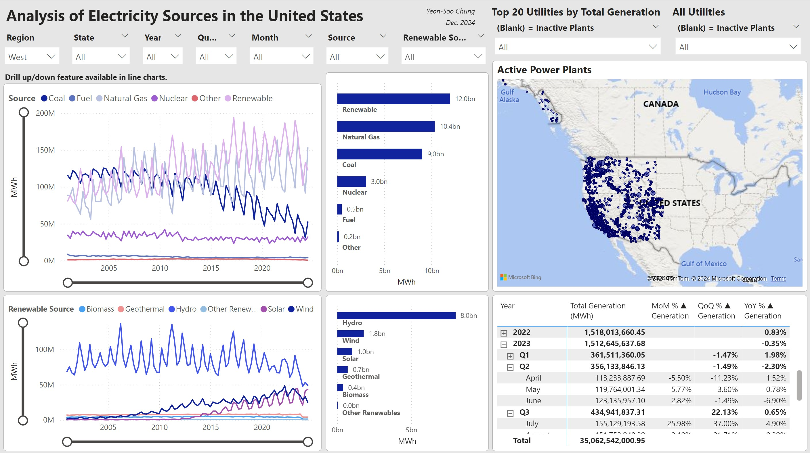
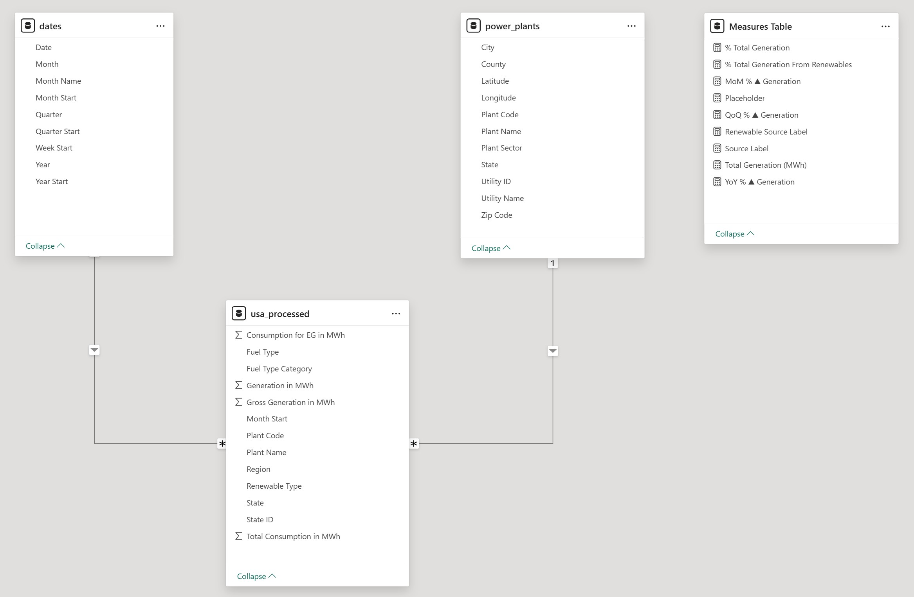

# Analysis of Electricity Sources in the United States

The Energy Information Administration (EIA) publishes a wealth of energy-related data collected across the country. In this project, I analyzed the sources of electricity generated in the United States. I used Apache Airflow to implement an automated ELT pipeline that extracts power plant electricity generation data from EIA’s API, loading it into a Google Cloud Service (GCS) bucket and subsequently into a BigQuery dataset. Also included in this project's GCS/BigQuery server is a data set of power plant locations (used their coordinates to create my dashboard's map visual), which I downloaded as a flat file, processing it to only include the columns I was interested in, from EIA’s website. After loading everything into BigQuery, the data was transformed with SQL queries to create the data model, and the associated data tables were loaded into Power BI for visual analysis.

To avoid posting any keys and credentials, I only uploaded the Python script for my Airflow DAG, SQL queries, and the docker-compose yaml file.

My interactive Power BI report can be viewed here (updated Jan. 6, 2026): https://app.powerbi.com/view?r=eyJrIjoiY2E0NWNiMWItYzMzZS00MWQzLWJhYzctYzk2OWQyYWJkZWQxIiwidCI6ImJlMjI4MDdiLTI1OTEtNDBkNy1iYmI2LTBkYTg0ZDMxYWNmNyIsImMiOjN9

EIA regularly updates their data retroactively, which is why there are noticeable decreasing trends in recent months, and smaller power plants generally take longer to get updated. Furthermore, upon data collection, the most recent available data is from a few months prior.

The report's pbix file can be downloaded here: https://drive.google.com/file/d/1nihOV5jaETVD_QEhFeA_B3EVbPGA1zwS

Below is an image of my report:

Note: Total generation here means total net generation, that is, gross generation minus electricity consumed by power plants.

## ELT Pipeline and Data Model

- **eia_electricity_usa_dag.py:** This Python script creates the Airflow DAG, pictured below.
  - 

    
    

  -	The DAG automates the pipeline as such:
    -	(1) latest_only ensures only the latest run is executed when the pipeline is initiated.
    -	(2) Download power plant electricity data via API calls to Docker container.
    -	(3) Upload the data from container to GCS.
    -	(4) Load data from GCS to BigQuery for SQL processing.
    -	(5) Load the power plants location data, which was uploaded manually to the GCS bucket, from GCS to BigQuery.
    -	(6) Run the dates.sql queries to create dates table for PBI
    -	(7) Run the process_df_usa.sql queries to process raw data fetched from the API calls. This file selects desired columns, recategorizes energy sources into broader categories (e.g., Wood Waste Solids is recategorized as Other Renewables), categorize states into regions, perform unit conversion, removes rows that would double-count generation data, and corrects geogrpahic errors in the data
    -	(8) Run the update_power_plants.sql queries to correct geographic errors in the power plants location data.
  -	The final data tables, called **usa_processed**, **dates**, and **power_plants**, are imported from BigQuery to Power BI. **usa_processed** contains over 2 million rows of data (the raw dataset had over 6 million).
  -	Since I use the free tier of Power BI Service, I am unable to implement an auto-refresh feature that updates the dashboard automatically with new BigQuery data. I would have to re-import the updated data in Power BI after the scheduled DAG is executed, and publish it to Service manually. I will make attempts to do this and update this repo each month.
- **Oct. 20, 2025 Update:** eia_electricity_usa_dag.py and the transformation files were updated so that in subsequent pipeline executions, the last 24 months of data is fetched via API call and processed, then appended to existing processed data that starts from 2025-01. This is to dramatically reduce execution time compared to collecting all the data since 2025-01 every run.

Below is an image of the data model in Power BI, demonstrating the relationships between the imported tables for this PBI report.

## Data Cleaning and Preparation

The previous section touched upon data processing steps applied with SQL. Below is a more comprehensive list of steps applied to the raw data itself.

- Standardized core field such as dates, numerical electricity generation values, and units of measurement to ensure consistency across reported values.
- Energy source labels in the raw data were too granular for my reporting purposes, so I recategorized them into more familiar, broader categories. Ex: ('Distillate Fuel Oil', 'Residual Fuel Oil', 'Petroleum Coke', 'Waste Oil and Other Oils') were recategorized as 'Fuel', ('Hydroelectric Pumped Storage', 'Hydroelectric Conventional') as 'Hydro', etc. This allows for clearer comparative analysis and reporting.
- One of the more critical issues involved potential double-counting of generation values, as electricity generation appeared across two categorical columns: 'fuelTypeDescription', which is energy source, and 'primeMover', which is the energy conversion device, e.g., engine, turbine, etc. In addition, both columns contain values of 'ALL' or 'Total', so directly summing the raw data's generation values will essentially sum "duplicate" values.

As described in the previous section, I used SQL to:

- Create a table of dates that cover the range of the total raw data. Columns such as month, year, and quarter were created to support time-based reporting in PBI.
- Correct geographical data errors identified in the power plants table.

I validated the data by reconciling aggregates reported in PBI against published reference source, e.g., compared yearly generation totals with published reference sources, and reviewed trends over time to ensure they aligned with known industry standards (ex: increase in renewable energy production). I also compared aggregated measures by directly querying the raw data to ensure transformations were performed accurately.

## Applications

In 2025, a consulting firm used a version of this dashboard to support site selection analysis for new hyperscale data centers. The dashboard was used to prioritize candidate locations based on proximity to power plants by energy source, with source-level generation capacity serving as a key operational metric.

For example, when evaluating potential data center sites in Illinois powered by natural gas, one can filter the dashboard by **State = Illinois** and **Source = Natural Gas**:

The dashboard surfaced the top electricity-generating utilities and displayed all power plant facilities by natural gas capacity within the state, allowing the firm to quickly assess which utilities and facilities were most capable of supporting data center-scale demand. This enabled early-stage screening of viable locations before engaging utilities and energy providers for deeper technical and commercial discussions.

