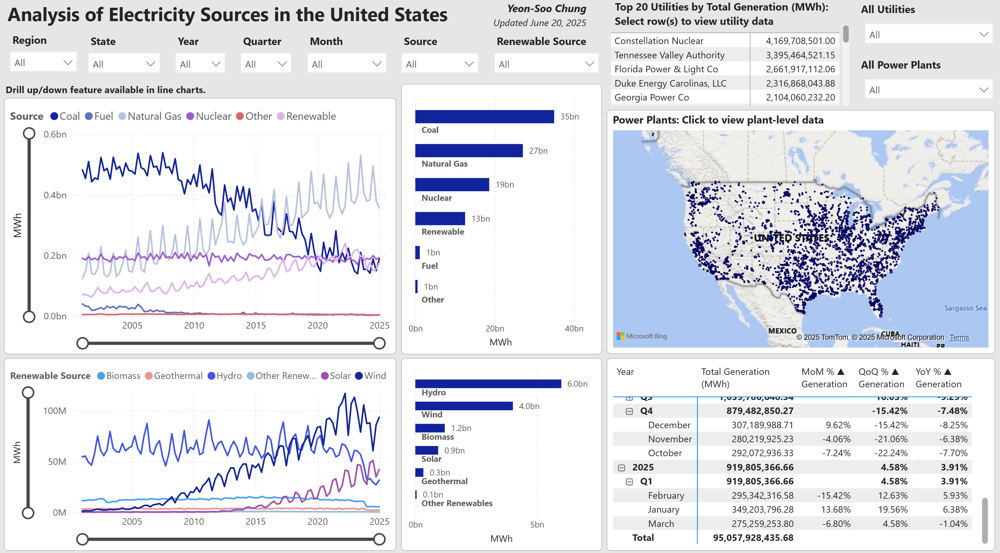
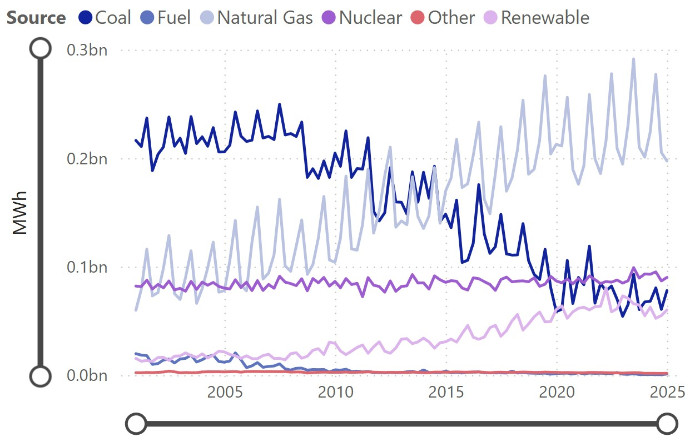
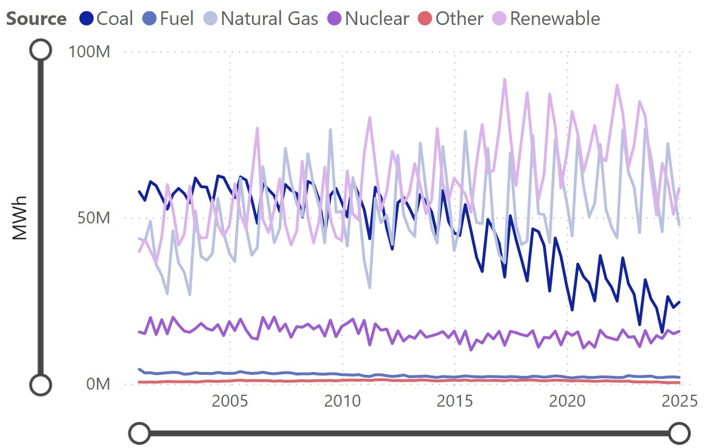
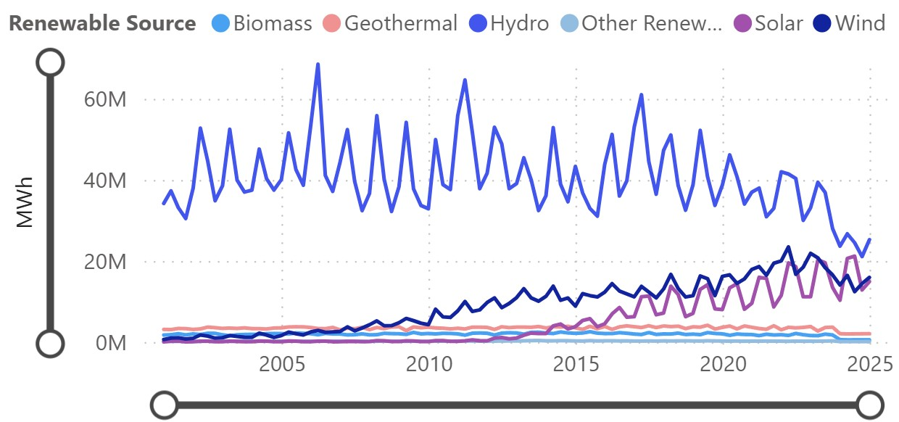

# Analysis of Electricity Sources in the United States

The Energy Information Administration (EIA) publishes a wealth of energy-related data collected across the country. In this project, I analyzed the sources of electricity generated in the United States. I implemented an ELT process that extracts power plant electricity generation data from EIA’s API along with power plant location data which was downloaded as a flat file from EIA’s website. The data was loaded into a Postgres database and transformed with SQL to create the data model, and the associated data tables were loaded into Power BI as views for visual analysis.

My interactive Power BI report can be viewed here: https://app.powerbi.com/view?r=eyJrIjoiOWEzZjFkZTctNGFhOC00OTVlLTg0YzUtZDcyMGJiZWIwMTljIiwidCI6ImJlMjI4MDdiLTI1OTEtNDBkNy1iYmI2LTBkYTg0ZDMxYWNmNyIsImMiOjN9

Its pbix file can be downloaded here: https://drive.google.com/file/d/1nvtkyzhptsOAziV_tn7Md7iHL6ipzlkU

Below is an image of my report:

## Summary of Findings

Across the entire data set, coal, natural gas, nuclear, and renewables have been the top sources of electricity. Electricity generated from coal has been declining since 2008, while the share of generation from natural gas and renewable energy sources has been steadily increasing. Electricity generated from nuclear power has been steadily consistent. In 2024 (through Sep.), natural gas was the largest source of electricity, more than double the next largest source, nuclear, which produced similar amounts of electricity as coal and renewables. 

Among renewable energy sources (across the entire data set), hydro is the dominant source of electricity, followed by wind. In recent years, however, wind has taken the top spot, while hydro and solar have converged. 

Below, I summarize my findings for each region. More detailed analysis can be performed with the interactive PBI report.

### Midwest

The Midwest somewhat mirrors national trends, except in recent years, the amount of electricity generated by the top four sources (coal, nuclear, natural gas, and renewables) have converged, with renewables appearing to dip.

Among renewables, wind is the dominant source of electricity, and it has been growing steadily as a source since 2007. The rest have been relatively low and stable in their output, but hydro has decreased in recent years, while solar has been seeing a slight increase.

### Northeast

As a source of electricity, coal has been decreasing since 2007, and in 2024, it made up only 2.3% of all electricity generated. Natural gas is the largest source of electricity in 2024, taking 57% of the share.

Hydro constitutes the bulk of electricity generated from renewable sources.

### South

Across the entire data set, the South generated by far the most electricity (86.7 billion MWh), almost doubling the next closest region (44.6 billion MWh from the Midwest). These values can be viewed in the dashboard’s matrix visual. Overall trends closely mirror national trends.

Wind has been the largest renewable source, but solar is catching up and overtook hydro in 2022.

### West

In the West, renewables and natural gas are the top two generators of electricity, outputting similar amounts of energy. These two sources generally peak and dip at off cycles from each other.

For most of the data set, hydro was the largest renewable source of electricity, but in recent years, it has been trending gradually downward, while wind and solar have been increasing. Latest trends appear to have these three sources converging soon.

## ELT Step and Data Model

- **eia-api.py:** This Python script calls EIA’s API to obtain power plant-level electricity data.
  -	To avoid overloading the API, I obtained data from the API and exported it to a csv for one to three states at a time. Data for CA was obtained as two csv files for debugging purposes.
  -	This code takes into account that each API request is limited to 5000 data points at a time.

- **eia-sql.sql:** This SQL script (PostgreSQL) does the following.
  -	Creates a table and view of dates covering the range of dates in the power plant electricity data.
  -	Creates a view of the power plant locations data. This view contains columns for month, month name, quarter, year, and more so that Power Query is not used to create new date-related columns in Power BI.
    - Contains 12,798 data points
  -	Processes the power plant electricity data to
    -	Convert energy units
    -	Categorize fuel types (i.e., electricity sources) into broader categories
    -	Categorize states into regions
    -	Create a view of the transformed table
    -	Contains 5,975,183 rows of data.
  -	The views “dates_view”, “power_plants_loc_view”, and “power_plants_usa_view” were imported to Power BI.

Below is an image of the data model in Power BI, demonstrating the relationships between the imported views for this PBI report.

